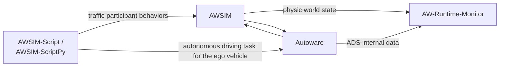

# AWSIM

This is a fork and extended version of [Autoware Foundation's AWSIM](https://autowarefoundation.github.io/AWSIM/), supporting some advanced behaviors for NPC vehicles and pedestrians.

## Additional Features

- Dynamic actions to control NPC behaviors, such as, lane change, acceleration and deceleration profiles.
- Two scenario description languages to specify desired scenarios: [AWSIM-Script](https://github.com/fomaad/AWSIM-ScriptPy/blob/main/Origin-AWSIM-Script.md) and [AWSIM-ScriptPy](https://github.com/fomaad/AWSIM-ScriptPy).
The usage of both languages is explained in the [AWSIM-ScriptPy repo](https://github.com/fomaad/AWSIM-ScriptPy), so please check it out for more details.

## Environment Requirements

The environment requirements are listed here: https://autowarefoundation.github.io/AWSIM/GettingStarted/QuickStartDemo/#demo-contents. NVIDIA driver needs to be installed.
For the best performance, network settings should be tuned by adding the following lines to `~/.bashrc` file:
```
if [ ! -e /tmp/cycloneDDS_configured ]; then
    sudo sysctl -w net.core.rmem_max=2147483647
    sudo sysctl -w net.ipv4.ipfrag_time=3
    sudo sysctl -w net.ipv4.ipfrag_high_thresh=134217728     # (128 MB)
    sudo ip link set lo multicast on
    touch /tmp/cycloneDDS_configured
fi
```

Source the `~/.bashrc` file to apply the changes:
``` bash
source ~/.bashrc
```

## Launching Binary Release

You can download a binary release from [here](https://github.com/fomaad/AWSIM/releases/download/v1.0.0/AWSIM.zip), unzip it, and launch the simulator using:

```bash
./awsim.x86_64
```

It may take some time for the application to start.

By default, Gaussian noise is added to the simulated data of LiDAR sensors. Use option `-noise` false to disable this noise.

```bash
./awsim.x86_64 -noise false
```

## Docker Image with AWSIM and Autoware
If you want to launch with Autoware, we provide a docker image with both AWSIM and Autoware installed.
In order to use it, in addition to Docker installation, the Nvidia container toolkit is also required to run docker with GPU support (pass through NVIDIA GPU from host to a Docker container). 
More information can be found at: https://github.com/NVIDIA/nvidia-container-toolkit.

The installation instructions for Nvidia container toolkit are available here: https://docs.nvidia.com/datacenter/cloud-native/container-toolkit/1.19.1/install-guide.html. Make sure to complete the step "Configuring Docker" and restart the Docker daemon after the installation.

Once the setup of Nvidia container toolkit finishes, pull the docker image from Docker Hub:
```
docker pull duongtd23/awsim-autoware171:latest
```
(here the Autoware version is 1.7.1)

Then, run the docker image with the following command:
```
docker run --rm -it --gpus all --net=host --ipc=host --cap-add=NET_ADMIN \
    -e DISPLAY=$DISPLAY -e XDG_RUNTIME_DIR=/run/user/$(id -u) \
    -e NVIDIA_VISIBLE_DEVICES=all -e NVIDIA_DRIVER_CAPABILITIES=all,graphics,compute \
    -v /tmp/.docker.xauth:/tmp/.docker.xauth:rw -e RCUTILS_COLORIZED_OUTPUT=1 \
    duongtd23/awsim-autoware171:latest /bin/bash
```

Then, connect one more terminal to the container by running the following command in another terminal:
```
docker exec -it -u 1000 <container_id> bash
```
Replace `<container_id>` with the container id, which can be found by running `docker ps` command.

In terminal #1, launch AWSIM:
```
cd /home/aw/AWSIM
./awsim.x86_64 -noise false
```

In terminal #2, launch Autoware:
```
cd /home/aw/autoware
source install/setup.bash
ros2 launch autoware_launch e2e_simulator.launch.xml vehicle_model:=sample_vehicle sensor_model:=awsim_sensor_kit map_path:=/home/aw/autoware_map/Shinjuku-Map/map/
```
A new window should appear. The localization mode (in the top-left window) should changes to "Initializing" and then eventually to "Initialized" (meaning that Autoware and AWSIM are successfully connected).

Now, you can play with the simulator and Autoware, such as, setting the goal pose for the ego vehicle, then clicking the "Auto" button to let Autoware drive the ego vehicle to the goal pose. More information can be found here: https://autowarefoundation.github.io/AWSIM/GettingStarted/QuickStartDemo/#4-run-awsim-and-autoware


Note that, if you want to compile Autoware from source instead of using the pre-built docker image, you can refer to the instructions in this repo: https://github.com/dtanony/Autoware0412.

## Using AWSIM-Script/AWSIM-ScriptPy and AW-Runtime-Monitor
[AW-Runtime-Monitor](https://github.com/duongtd23/AW-Runtime-Monitor) is a runtime monitor that:
- Records traffic participants' dynamics and ADS (Autoware) internal state (e.g., planning trajectories, control commands, perceived objects, etc.) during simulation and dumps the information to a trace file once the simulation finishes.
- Can monitor the safety of a control command produced by ADS, and if it is unsafe, activate AEB.

[AWSIM-Script](https://github.com/fomaad/AWSIM-ScriptPy/blob/main/Origin-AWSIM-Script.md) is a scenario description language that allows users to specify driving scenarios for the ego vehicle and other traffic participants. 
[AWSIM-ScriptPy](https://github.com/fomaad/AWSIM-ScriptPy) is a Python-based extension of AWSIM-Script.

The idea of using AWSIM-Script(Py) and AW-Runtime-Monitor together with AWSIM and Autoware is shown in the figure below. 
We can replace  AWSIM-Script(Py) with other scenario description language, e.g., Scenic (interested user can check the [extended Scenic](https://github.com/fomaad/Scenic) to be work with AWSIM).



#### 1) Using AWSIM-ScriptPy to simulate a desired scenario
The docker image above already has AWSIM-ScriptPy (in the `home` folder).
First, follow the instructions above to run the docker image, launch AWSIM and Autoware, and make sure they are connected. Then, to run a cut-in scenario example provided here https://github.com/fomaad/AWSIM-ScriptPy#python-scenario-specification,
in another terminal connected to the docker container, run the following command:
```bash
cd /home/aw/AWSIM-ScriptPy
source /home/aw/autoware/install/setup.bash
python -m scenarios.cutin.example
```

You should now see the ego vehicle starts to drive.
Check the [AWSIM-ScriptPy repo](https://github.com/fomaad/AWSIM-ScriptPy) for more details about how to specify a scenario using either AWSIM-Script or AWSIM-ScriptPy.

#### 2) Using AW-Runtime-Monitor to record camera video and other data during simulation
To record camera video and other data during simulation, you can run the following command in another terminal connected to the docker container before running the scenario with AWSIM-Script(Py):
```bash
cd /home/aw/AW-Runtime-Monitor
source /home/aw/autoware/install/setup.bash
source .venv/bin/activate
python main.py -o <path-to-folder-to-save-traces>
```

By default, it is enabled.
For more details about the tool usage, use `python main.py -h`.

```bash
$ python main.py -h
usage: main.py [-h] [-o OUTPUT] [-f {json,yaml}] [-n NO_SIM]

Runtime Monitor for Autoware and AWSIM simulator. Adjust the component to record data by modifying
file config.yaml

options:
  -h, --help            show this help message and exit
  -o OUTPUT, --output OUTPUT
                        Output trace file name (default: auto-generated with timestamp)
  -f {json,yaml}, --format {json,yaml}
                        either json or yaml (default: json)
  -n NO_SIM, --no_sim NO_SIM
                        Simulation number, use as suffix to the file name (default: 1)
```

If multiple scenarios are fed (by AWSIM-Script(Py)), when a scenario terminates (i.e., when the ego vehicle reaches its goal), the recorded data will be saved to folder `<path-to-folder-to-save-traces>` with incremental numbering.

Check the [AW-Runtime-Monitor repo](https://github.com/duongtd23/AW-Runtime-Monitor) for more details about how to use the tool and how to modify the configuration file `config.yaml` to record different data.

## Unity Project Setup
We recommend using the binary release for most use cases. However, if you want to run the simulator inside the Unity Editor or make some modifications, follow this instruction from AWSIM document to import this project to the Unity Editor: https://autowarefoundation.github.io/AWSIM/DeveloperGuide/SetupUnityProject/.
